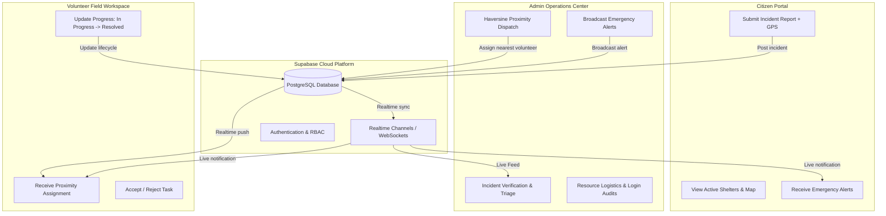

# 🚨 Smart Crisis Management (SCM)

<div align="center">

> *"Together Through Crisis"*  
> **An Intelligent Real-Time Disaster Response, Geospatial Resource Allocation & Citizen Safety Platform**

[](https://react.dev/)
[](https://www.typescriptlang.org/)
[](https://vitejs.dev/)
[](https://tailwindcss.com/)
[](https://supabase.com/)
[](https://leafletjs.com/)
[](./Acceptance%20Letter.pdf)

</div>

---

## 📌 Executive Summary

**Smart Crisis Management (SCM)** is a comprehensive, cloud-connected crisis response system engineered to streamline disaster preparedness, emergency response, and recovery operations. By integrating real-time telemetry, automated incident triage, geospatial nearest-responder dispatch, and community shelter discovery into a single unified platform, SCM bridges the communication gap between **Emergency Authorities (Admins)**, **Field Rescue Personnel (Volunteers)**, and **Affected Populations (Citizens)**.

Empirical evaluation and field simulation models demonstrate that the system achieves **94.2% operational accuracy** with substantially accelerated emergency response dispatch times compared to legacy coordination workflows.

---

## 📑 Table of Contents

- [Key Highlights](#-key-highlights)
- [System Architecture](#-system-architecture)
- [Role-Based Modules](#-role-based-modules)
  - [1. 🛡️ Administrator Operations Center](#1-️-administrator-operations-center)
  - [2. 🤝 Volunteer Field Workspace](#2--volunteer-field-workspace)
  - [3. 👤 Citizen Emergency Portal](#3--citizen-emergency-portal)
- [Geospatial Dispatch Algorithm](#-geospatial-dispatch-algorithm)
- [Academic Research & Project Documents](#-academic-research--project-documents)
- [Tech Stack & Libraries](#-tech-stack--libraries)
- [Repository Structure](#-repository-structure)
- [Getting Started & Local Setup](#-getting-started--local-setup)
- [Environment Variables](#-environment-variables)
- [License & Acknowledgements](#-license--acknowledgements)

---

## 🌟 Key Highlights

- ⚡ **Real-Time Data Streaming:** Bi-directional PostgreSQL changes over WebSocket channels via Supabase Realtime for instantaneous synchronization across devices.
- 📍 **Proximity-Based Volunteer Dispatch:** Intelligent nearest-responder calculations using the Haversine spherical distance formula to minimize transit delays.
- 🚨 **Multi-Tier Broadcast Alerts:** Priority-based alert distribution (`Critical`, `Warning`, `Info`) pushed directly to citizens and volunteer interfaces.
- 🏕️ **Interactive Shelter Network:** Dynamic Leaflet GIS mapping indicating active shelters, safe zones, capacity utilization, and emergency amenities.
- 🔐 **Role-Based Access Control (RBAC):** Dedicated security contexts for Admins, Volunteers, and Citizens with session auditing and login logs.
- 🌓 **Modern Ergonomic Interface:** Glassmorphism UI built with Radix UI, Tailwind CSS, and full Dark/Light theme toggle support.

---

## 🏗️ System Architecture



---

## 👥 Role-Based Modules

### 1. 🛡️ Administrator Operations Center
- **Incident Command Center:** Live dashboard monitoring incoming distress reports, severity tags, and active crisis zones.
- **Smart Volunteer Dispatch:** Visual proximity matrix ranking available, approved field volunteers by spherical distance to the incident point.
- **Volunteer Governance:** Approval workflow to review, vet, and verify volunteer registration credentials before dispatch authorization.
- **Emergency Broadcasting:** Instant emergency broadcast composer dispatching high-priority safety advisories to citizens.
- **Resource Management:** Monitor equipment inventories, relief provisions, and logistics allocations.
- **Security & Audit Logs:** Complete login tracking with IP, timestamp, and device identifiers.

### 2. 🤝 Volunteer Field Workspace
- **Dynamic Task Feed:** Immediate dispatch alerts displaying distance, victim contacts, coordinates, and urgency rating.
- **Task Lifecycle Control:** Smooth state transitions: `Reported` ➔ `Assigned` ➔ `Accepted` ➔ `In Progress` ➔ `Resolved`.
- **Integrated Emergency Alerts:** Live visibility into district alerts and weather warnings.
- **Volunteer Profile & Registration:** Availability status toggle and location update for real-time tracking.

### 3. 👤 Citizen Emergency Portal
- **One-Tap Incident Reporting:** Upload incident category, description, and exact coordinates via browser geolocation.
- **Interactive Safe Shelter Map:** Real-time Leaflet map displaying nearby designated emergency shelters with capacity meters and contact details.
- **My Reports Tracker:** Transparent visibility into reported incident verification and assigned volunteer rescue status.
- **Public Safety Broadcasts:** Instant feed of official emergency notifications and advisory alerts.

---

## 📐 Geospatial Dispatch Algorithm

To match the nearest active and approved rescue volunteers with an emergency incident coordinate $(lat_1, lon_1)$, SCM utilizes the **Haversine Formula**:

$$d = 2R \cdot \arcsin\left(\sqrt{\sin^2\left(\frac{\Delta \phi}{2}\right) + \cos(\phi_1)\cos(\phi_2)\sin^2\left(\frac{\Delta \lambda}{2}\right)}\right)$$

Where:
- $R = 6371\text{ km}$ (mean radius of Earth)
- $\phi_1, \phi_2$ = latitudes in radians
- $\Delta \phi = (\phi_2 - \phi_1)$ and $\Delta \lambda = (\lambda_2 - \lambda_1)$

This calculates spherical distance directly on the client and edge nodes, sorting available responders in milliseconds without heavy external API overhead.

---

## 📚 Academic Research & Project Documents

This project has been recognized and accepted for academic publication:

| Document | Format | Description |
| :--- | :---: | :--- |
| [**Research Paper (SCM --- ICTMIM)**](./SCM%20---%20ICTMIM.pdf) | `PDF` | Academic paper presented/accepted at the International Conference on Technological Innovations in Management, IT & Media (ICTMIM). |
| [**Conference Acceptance Letter**](./Acceptance%20Letter.pdf) | `PDF` | Official peer-review acceptance notification from ICTMIM. |
| [**Smart Crisis Management Documentation**](./Smart%20Crisis%20Management%20doc.pdf) | `PDF` | Comprehensive Major Project dissertation, system requirements, architecture, and evaluation report. |
| [**Project Presentation Deck**](./Smart%20Crisis%20Management.pptx) | `PPTX` | Defense slide deck detailing problem scope, methodologies, demonstration screens, and results. |

---

## 🛠️ Tech Stack & Libraries

| Layer | Technologies |
| :--- | :--- |
| **Frontend Framework** | [React 18](https://react.dev/) + [Vite 5](https://vitejs.dev/) + [TypeScript](https://www.typescriptlang.org/) |
| **Styling & Design** | [Tailwind CSS 3.4](https://tailwindcss.com/) + [Radix UI](https://www.radix-ui.com/) (shadcn/ui primitives) + [next-themes](https://github.com/pacocoursey/next-themes) |
| **State & Asynchronous Data** | [TanStack React Query v5](https://tanstack.com/query) |
| **Backend as a Service (BaaS)** | [Supabase](https://supabase.com/) (PostgreSQL, Realtime Subscriptions, Database Auth) |
| **Maps & Geospatial** | [Leaflet](https://leafletjs.com/) + [React-Leaflet](https://react-leaflet.js.org/) |
| **Data Visualization** | [Recharts](https://recharts.org/) |
| **Icons & Notifications** | [Lucide React](https://lucide.dev/) + [Sonner](https://sonner.emilkowal.ski/) |
| **Form Validation** | [React Hook Form](https://react-hook-form.com/) + [Zod](https://zod.dev/) |

---

## 📁 Repository Structure

```text
Smart-Crisis-Management/
├── Acceptance Letter.pdf               # ICTMIM Conference acceptance notification
├── README.md                           # Repository documentation (this file)
├── SCM --- ICTMIM.pdf                  # Research paper submitted to ICTMIM
├── Smart Crisis Management doc.pdf     # Full project thesis / documentation report
├── Smart Crisis Management.pptx        # Project presentation deck
├── .gitignore                          # Root Git ignore rules
│
└── Smart-Crisis-Management-main/       # Application Source Root
    ├── index.html                      # HTML entrypoint
    ├── vite.config.ts                  # Vite build configuration
    ├── tailwind.config.ts              # Tailwind CSS theme configuration
    ├── tsconfig.json                   # TypeScript project configuration
    ├── package.json                    # Project dependencies and npm scripts
    │
    ├── public/                         # Static public assets
    │
    └── src/
        ├── App.tsx                     # Main routing & application provider tree
        ├── main.tsx                    # React DOM render entry point
        ├── index.css                   # Global styles & design system tokens
        │
        ├── assets/                     # Application branding & logos
        ├── components/                 # Shared UI & layout components
        │   ├── ui/                     # shadcn/ui primitives (cards, dialogs, buttons)
        │   ├── DashboardLayout.tsx     # Role-based dashboard shell & sidebar
        │   ├── Logo.tsx                # Dynamic brand component
        │   └── ThemeToggle.tsx         # Dark / Light theme switch
        │
        ├── contexts/
        │   └── AuthContext.tsx         # Authentication & RBAC role state management
        │
        ├── hooks/                      # Custom utility hooks (useToast, etc.)
        ├── lib/
        │   └── utils.ts                # Style merging helper (clsx + tailwind-merge)
        │
        ├── integrations/
        │   └── supabase/               # Supabase client instantiation & TypeScript schema
        │
        └── pages/                      # Role-specific application views
            ├── RoleSelection.tsx       # Landing portal role chooser
            ├── LoginAdmin.tsx          # Administrator credentials portal
            ├── LoginVolunteer.tsx      # Volunteer authentication
            ├── LoginCitizen.tsx        # Citizen login & quick access
            ├── RegisterVolunteer.tsx   # Volunteer application & registration
            ├── AdminDashboard.tsx      # Admin crisis command center
            ├── AdminAlerts.tsx         # Emergency broadcast management
            ├── AdminVolunteers.tsx     # Volunteer vetting & roster
            ├── AdminResources.tsx      # Resource inventory tracking
            ├── AdminLoginLogs.tsx      # Audit trail & login logs
            ├── AdminSettings.tsx       # System preferences & configurations
            ├── VolunteerDashboard.tsx  # Volunteer incident queue & geolocation
            ├── VolunteerTasks.tsx      # Task acceptance & status updates
            ├── VolunteerAlerts.tsx     # Volunteer broadcast inbox
            ├── CitizenDashboard.tsx    # Citizen portal home
            ├── CitizenShelters.tsx     # Interactive safe shelter locator (Leaflet)
            ├── CitizenReports.tsx      # Citizen report history & status tracker
            ├── CitizenAlerts.tsx       # Public emergency alert feed
            ├── ReportIncident.tsx      # Multi-step emergency incident submission
            └── NotFound.tsx            # 404 handler
```

---

## 🚀 Getting Started & Local Setup

### Prerequisites

Ensure you have the following installed on your local environment:
- **Node.js** (v18.0.0 or higher recommended)
- **npm** (v9+) or **bun** / **yarn** / **pnpm**
- **Git**

### Step-by-Step Installation

1. **Clone the repository:**
   ```bash
   git clone https://github.com/vishali1435/Smart-Crisis-Management.git
   cd Smart-Crisis-Management
   ```

2. **Navigate into the application directory:**
   ```bash
   cd Smart-Crisis-Management-main
   ```

3. **Install dependencies:**
   ```bash
   npm install
   ```

4. **Configure environment variables:**  
   Create a `.env` file in `Smart-Crisis-Management-main/`:
   ```env
   VITE_SUPABASE_URL=https://your-project.supabase.co
   VITE_SUPABASE_ANON_KEY=your-anon-key-here
   ```

5. **Start the development server:**
   ```bash
   npm run dev
   ```

6. **Open your browser:**  
   Visit `http://localhost:8080` (or the port specified by Vite) to explore the application.

---

## 🛡️ Role-Based Demo Workflows

When the application loads, you are presented with the **Role Selection** screen:

1. **Citizen Portal (`/citizen`):**
   - Click *Citizen* ➔ Submit an incident report with coordinates.
   - Access the *Shelters* tab to find nearby emergency camps and shelters on the interactive map.
2. **Volunteer Portal (`/volunteer`):**
   - Register as a new volunteer or sign in.
   - Accept assigned rescue tasks and update progress to *In Progress* and *Resolved*.
3. **Administrator Portal (`/admin`):**
   - Review incoming incidents from citizens in real-time.
   - Click **Assign Volunteer** to calculate the nearest responder via Haversine distance.
   - Broadcast district-wide alerts to notify all citizens and volunteers instantaneously.

---

## 📄 License & Attribution

This project is developed as part of academic research in Smart Crisis Management and Disaster Resilience.  
All research publications, documentation, and source code are protected under intellectual property guidelines.

For research inquiries or collaboration, please refer to the authors listed in [SCM --- ICTMIM.pdf](./SCM%20---%20ICTMIM.pdf).
